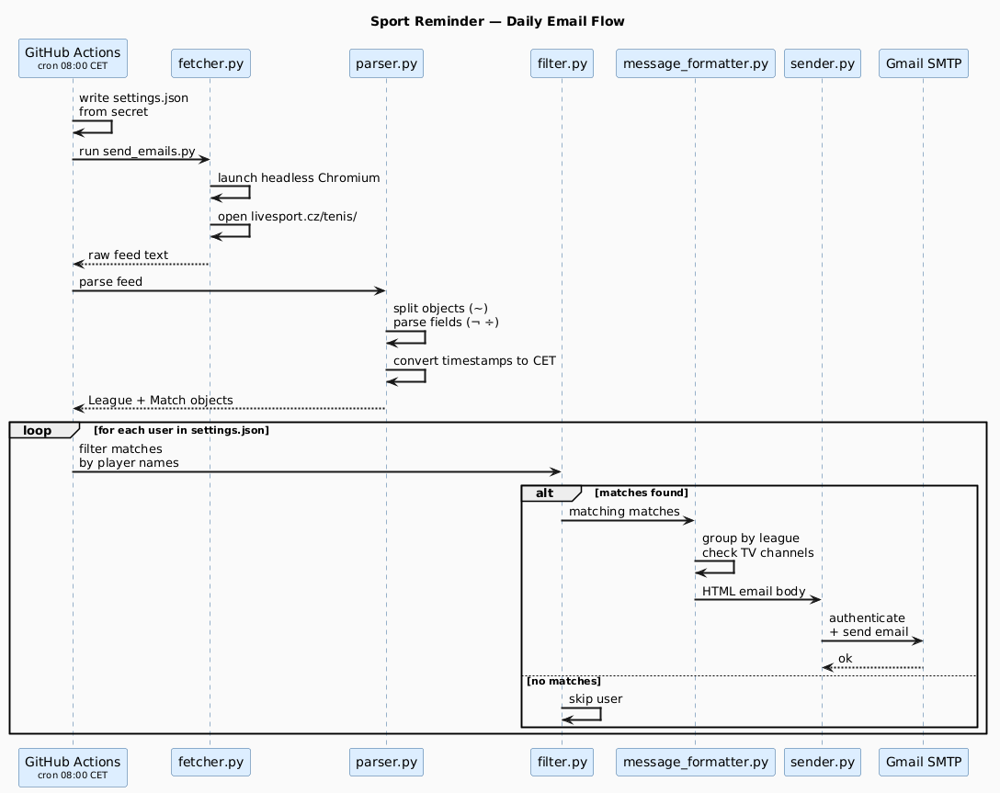

# Sport Reminder

Never miss a match. Get a daily email with today's tennis matches featuring your favourite players.

## Why

I don't follow sports daily, but I care a lot about specific players and matches. Important games kept slipping by unnoticed — so I built this to fix that.

## Flow



## How it works

1. A headless Chromium browser (Playwright) opens [livesport.cz](https://www.livesport.cz/tenis/) and intercepts the live data feed
2. The raw feed is parsed into match objects (league, players, time, TV channel)
3. Each user's configured player filters are applied
4. Matching matches are formatted as HTML and sent via Gmail SMTP

No external sports APIs — just parsing a site that's been free for years and will likely stay that way.

## Automation

A GitHub Actions workflow runs every day at **8:00 AM CET** and sends emails to all configured recipients. It can also be triggered manually from the Actions tab.

## Local usage

```bash
pip install -r requirements.txt
playwright install chromium
python src/main.py
```

Options:
- `1` — Open the Streamlit GUI to manage users and filters
- `3` — Send emails immediately to all configured participants

## Configuration

User preferences live in `src/settings.json`:

```json
[
  {
    "filter": "Alcaraz,Sinner,Djokovic",
    "email": "you@example.com"
  }
]
```

Add as many users as you want — each gets their own filtered email.

## Secrets (for GitHub Actions)

Set these as repository secrets:

| Secret | Description |
|---|---|
| `EMAIL_ADDRESS` | Gmail address used to send emails |
| `EMAIL_PASSWORD` | Gmail app-specific password |
| `SETTINGS_JSON` | Full contents of `settings.json` |

`settings.json` is gitignored — the workflow writes it from the secret at runtime.

## Dependencies

- `playwright` — headless browser for scraping
- `python-dotenv` — local env vars
- `streamlit` — GUI for managing settings
